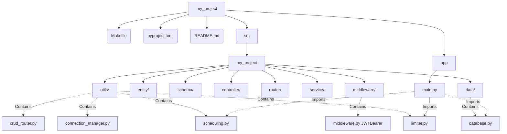

# ⚡ FastForge

FastForge is a powerful, Symfony-style CLI scaffolder designed to bootstrap and accelerate the development of FastAPI applications. It provides a robust, production-ready directory structure, fully integrated with `uv` for lightning-fast package management, alongside essential utilities like rate limiting, scheduling, WebSocket management, and JWT middleware.

## 🚀 Installation

Since FastForge manages virtual environments and dependencies via `uv`, you should install it globally using `uv tool`:

```bash
uv tool install git+https://github.com/SavanTech25/fastforge.git
```

## 🛠️ Usage

### 1. Initialize a Project

To bootstrap a new project, use the `init` command. You can specify your preferred database engine (`sqlite`, `postgresql`, `mysql`, or `mongodb`).

```bash
fastforge init my_project --db mongodb
```

This will create a structured FastAPI project that utilizes `pyproject.toml` and a `Makefile` for streamlined development.

### 2. Run the Scaffolded Project

Navigate into your generated project and install dependencies:

```bash
cd my_project
make install
source .venv/bin/activate
```

Start the development server:

```bash
make run
```

### 3. Generate Entities (Models, Schemas, Controllers, Routers)

FastForge features a `make:entity` command that automatically generates your boilerplate code for a given entity. Make sure you run this from the root of your newly created project!

```bash
fastforge make:entity User name:string age:int email:string:hash is_active:bool
```

**Field Syntax:** `name:type[:modifier]`
- **Types:** `string`, `int`, `float`, `bool`, `text`, `date`, `datetime`
- **Modifiers:** `encrypt`, `hash`, `nullable`, `fk=ModelName`

## 🏗️ Architecture

When you initialize a project with FastForge, it generates a clean, modular structure. 

### Generated Directory Structure



### Explanation of Components

- **`app/main.py`**: The main FastAPI entry point. It handles lifecycle events (connecting to the database, starting schedulers) and attaches rate limiters.
- **`src/{project_name}/`**: Your primary application package, automatically recognized by `pyproject.toml` and `uv`.
  - **`entity/`**: Database models (SQLAlchemy or motor/MongoDB depending on your `init` choice).
  - **`schema/`**: Pydantic models for validation and serialization.
  - **`controller/`**: Business logic and database interaction functions.
  - **`router/`**: API route definitions, connected to your controllers.
  - **`data/`**: Database configuration and connection setup.
  - **`middleware/`**: Contains pre-configured `JWTBearer` middleware for instant authentication handling.
  - **`utils/`**:
    - `limiter.py`: Pre-configured `slowapi` rate limiting.
    - `scheduling.py`: Asynchronous background task scheduler via `apscheduler`.
    - `connection_manager.py`: Generic WebSocket manager.
    - `crud_router.py`: A generic factory for building standard CRUD routes effortlessly.
